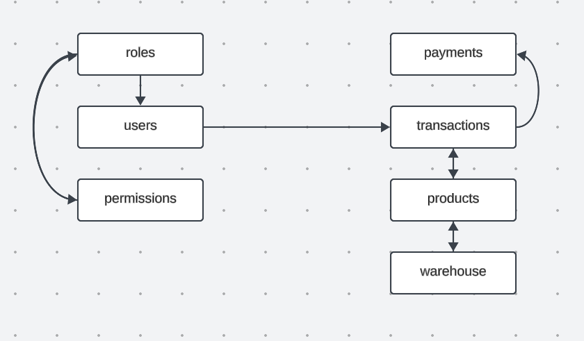
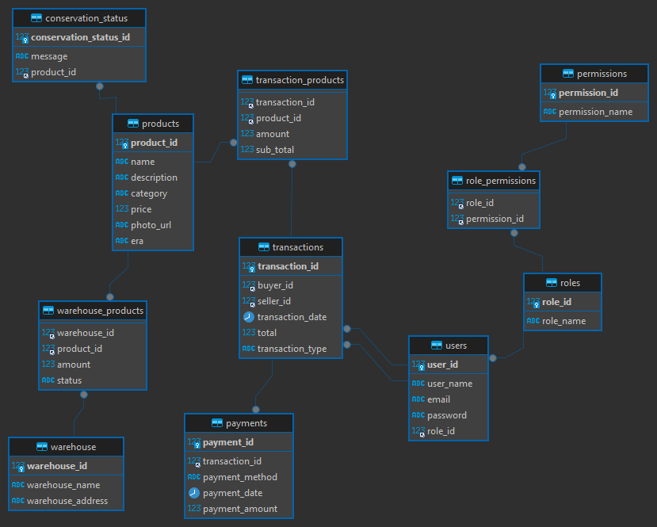

# Sistema de Gestión de Antigüedades

Este proyecto proporciona una solución de base de datos para un negocio de antigüedades. El sistema permite gestionar usuarios, roles, productos (antigüedades), transacciones, y almacenes, entre otros aspectos. Incluye consultas para listar antigüedades, buscar por categoría y rango de precios, gestionar inventario y ventas, entre otras funcionalidades.


## Diagramas





## Tablas Principales

#### 1. `roles`
- Define los roles de los usuarios (Admin, User, Seller, Buyer).

#### 2. `users`
- Almacena la información de los usuarios, como su nombre, email y rol asociado.

#### 3. `products`
- Contiene información sobre las antigüedades, como nombre, descripción, categoría, precio, y era.

#### 4. `transactions`
- Registra las transacciones realizadas entre compradores y vendedores.

#### 5. `permissions`
- Define los permisos disponibles en el sistema.

#### 6. `role_permissions`
- Asocia permisos específicos a cada rol.

#### 7. `transaction_products`
- Relaciona productos con transacciones específicas, incluyendo cantidades y subtotales.

#### 8. `payments`
- Almacena los detalles de los pagos realizados por transacciones.

#### 9. `warehouse`
- Define los almacenes donde se almacenan las antigüedades.

#### 10. `warehouse_products`
- Registra qué productos se encuentran en cada almacén y su estado (disponible para la venta, reservado, etc.).

#### 11. `conservation_status`
- Registra el estado de conservación de cada antigüedad.

## Consultas Principales

#### 1. Listar todas las antigüedades disponibles para la venta
```sql
SELECT p.name AS 'Nombre de la Pieza', p.category AS 'Categoría', p.price AS 'Precio', c.message AS 'Estado de Conservación'
FROM products p
LEFT JOIN conservation_status c ON p.product_id = c.product_id
WHERE p.product_id IN (
    SELECT product_id FROM warehouse_products WHERE status = 'for_sale'
);
```

#### 2. Buscar antigüedades por categoría y rango de precio
```sql
SELECT p.name AS 'Nombre de la Pieza', p.category AS 'Categoría', p.price AS 'Precio'
FROM products AS p
WHERE p.category = 'Decor' AND p.price BETWEEN 100 AND 2000;
```

#### 3. Mostrar el historial de ventas de un cliente específico
```sql
SELECT t.transaction_date AS 'Fecha de Venta', p.name AS 'Nombre de la Pieza', tp.sub_total AS 'Precio de Venta', u.user_name AS 'Comprador'
FROM transactions AS t
INNER JOIN transaction_products tp ON t.transaction_id = tp.transaction_id
INNER JOIN products p ON tp.product_id = p.product_id
INNER JOIN users AS u ON t.buyer_id = u.user_id
WHERE t.seller_id = (SELECT user_id FROM users WHERE user_name = 'Seller1');
```

#### 4. Obtener el total de ventas realizadas en un periodo de tiempo
```sql
SELECT SUM(t.total) AS 'Total de Ventas'
FROM transactions AS t
WHERE t.transaction_date BETWEEN '2024-09-10' AND '2024-09-16';
```


#### 5. Encontrar los clientes más activos (con más compras realizadas)
```sql
SELECT u.user_name AS 'Cliente', COUNT(t.transaction_id) AS 'Número de Compras'
FROM transactions AS t
INNER JOIN users u ON t.buyer_id = u.user_id
GROUP BY u.user_id
ORDER BY COUNT(t.transaction_id) DESC
LIMIT 5;
```

#### 6. Listar las antigüedades más populares por número de visitas
```sql

```


#### 7. Listar las antigüedades vendidas en un rango de fechas específico
```sql
SELECT DISTINCT p.name AS 'Nombre de la Pieza', t.transaction_date AS 'Fecha de Venta', s.user_name AS 'Vendedor', b.user_name AS 'Comprador'
FROM transactions t
INNER JOIN transaction_products tp ON t.transaction_id = tp.transaction_id
INNER JOIN products p ON tp.product_id = p.product_id
INNER JOIN users s ON t.seller_id = s.user_id
INNER JOIN users b ON t.buyer_id = b.user_id
WHERE t.transaction_date BETWEEN '2024-09-10' AND '2024-09-20';
```


#### 8. Obtener un informe de inventario actual
```sql
SELECT p.category AS 'Categoría', COUNT(wp.product_id) AS 'Cantidad de Artículos'
FROM warehouse_products wp
INNER JOIN products p ON wp.product_id = p.product_id
GROUP BY p.category;
```
